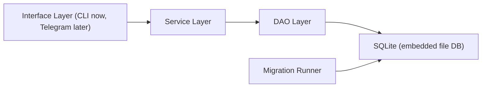

# leetcoach v1 Software Design

This document describes the internal software design only.
For data model and command behavior, see [`docs/v1-spec.md`](docs/v1-spec.md).

## Architecture



Core design rule:
- interface calls services
- services call DAOs
- DAOs perform SQL

No layer skips downward boundaries.

## Layers and Responsibilities

### Interface Layer
- entrypoint: `main.py`
- currently supports: `run`, `migrate`
- future: Telegram handlers

### Service Layer
- implements use-cases (for example: log problem)
- coordinates multiple DAO calls in one flow
- owns transaction boundaries for multi-step operations

### DAO Layer
- table-oriented DB operations only
- no business flow orchestration
- no transport formatting

### Database Layer
- SQLite file storage
- migrations define/upgrade schema
- `schema_migrations` tracks applied migration files

## CLI Help

```text
Usage:
  python main.py [command]

Commands:
  run       Start app bootstrap (default command)
  migrate   Apply DB migrations
  --help    Show CLI help
```
