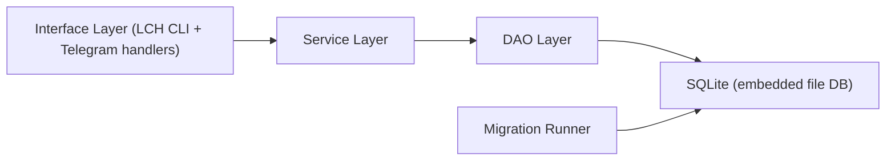

# leetcoach v1 Software Design

This document describes the internal software design only.
For data model and command behavior, see [`docs/v1-spec.md`](docs/v1-spec.md).

## Architecture

Core design rule:
- interface calls services
- services call DAOs
- DAOs perform SQL

No layer skips downward boundaries.

## Layers and Responsibilities

### Interface Layer
- primary entrypoint: `lch` (`project.scripts` -> `leetcoach.cli:cli`)
- compatibility entrypoint: `python main.py` (wrapper that calls same CLI)
- current CLI commands: `run`, `migrate`, `test`, `bot`, `scheduler`, `doctor`, `import-notion`
- Telegram handlers: `/start`, `/register`, `/help`, `/log`, `/due`, `/reviewed <token>`, `/search`, `/list`, `/pattern`, `/remind ...`

### Service Layer
- implements use-cases (for example: log problem)
- coordinates multiple DAO calls in one flow
- owns transaction boundaries for multi-step operations

### DAO Layer
- table-oriented DB operations only
- no business flow orchestration
- no transport formatting

### Database Layer
- SQLite file storage
- migrations define/upgrade schema
- `schema_migrations` tracks applied migration files

## Runtime Modes

- local process mode: run CLI/bot directly on host (`lch ...`)
- container mode: same CLI and bot commands executed via Docker image/compose
- scheduler mode: periodic outbound reminder loop via `lch scheduler`

Both modes use the same layered design and SQLite schema.
