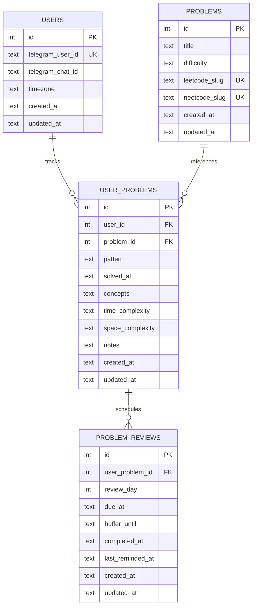

# leetcoach v1 Data and Behavior Spec

## Scope (v1)

This spec covers only:
- log problems
- retrieve/search problems
- due review list
- mark review done
- reminder scheduling for day 7 and day 21 with 48h grace

Deferred:
- attempts/history table
- trivia/flashcards
- dashboard

## Entity Relationship Model

Cardinality legend for Mermaid ER syntax:
- `||` means exactly one
- `o{` means zero or many

Equivalent UML-style multiplicities:
- `User 1 ----- 0..* UserProblem`
- `Problem 1 ----- 0..* UserProblem`
- `UserProblem 1 ----- 0..* ProblemReview`

## Table Definitions

### `users`

Purpose:
- one row per Telegram user
- isolates all data by user

Fields:
- `id` INTEGER PRIMARY KEY
- `telegram_user_id` TEXT NOT NULL UNIQUE
- `telegram_chat_id` TEXT NOT NULL
- `timezone` TEXT NOT NULL DEFAULT `'UTC'`
- `created_at` TEXT NOT NULL
- `updated_at` TEXT NOT NULL

### `problems`

Purpose:
- global canonical problem definition
- not tied to any specific user

Fields:
- `id` INTEGER PRIMARY KEY
- `title` TEXT NOT NULL
- `difficulty` TEXT NOT NULL CHECK (`difficulty IN ('easy','medium','hard')`)
- `leetcode_slug` TEXT NULL UNIQUE
- `neetcode_slug` TEXT NOT NULL UNIQUE
- `created_at` TEXT NOT NULL
- `updated_at` TEXT NOT NULL

Constraints and indexes:
- unique index/constraint on `leetcode_slug` when present
- unique index/constraint on `neetcode_slug` (required)
- index on `title`

URL construction (application layer, not DB):
- LeetCode URL is constructed from `leetcode_slug`
- NeetCode URL is constructed from `neetcode_slug` using NeetCode's path pattern

### `user_problems`

Purpose:
- user-specific tracking record for a canonical problem
- stores per-user prep notes and solve metadata

Fields:
- `id` INTEGER PRIMARY KEY
- `user_id` INTEGER NOT NULL REFERENCES `users(id)` ON DELETE CASCADE
- `problem_id` INTEGER NOT NULL REFERENCES `problems(id)` ON DELETE CASCADE
- `pattern` TEXT NOT NULL
- `solved_at` TEXT NOT NULL
- `concepts` TEXT NULL
- `time_complexity` TEXT NULL
- `space_complexity` TEXT NULL
- `notes` TEXT NULL
- `created_at` TEXT NOT NULL
- `updated_at` TEXT NOT NULL

Constraints and indexes:
- unique index: (`user_id`, `problem_id`)
- index: (`user_id`, `pattern`)
- index: (`user_id`, `solved_at`)

Notes:
- `concepts`, `time_complexity`, `space_complexity`, and `notes` are plain `TEXT` and can store multiline markdown or plain text.

### `problem_reviews`

Purpose:
- checkpoint/tick-off rows used by reminders and due tracking

Fields:
- `id` INTEGER PRIMARY KEY
- `user_problem_id` INTEGER NOT NULL REFERENCES `user_problems(id)` ON DELETE CASCADE
- `review_day` INTEGER NOT NULL CHECK (`review_day IN (7, 21)`)
- `due_at` TEXT NOT NULL
- `buffer_until` TEXT NOT NULL
- `completed_at` TEXT NULL
- `last_reminded_at` TEXT NULL
- `created_at` TEXT NOT NULL
- `updated_at` TEXT NOT NULL

Constraints and indexes:
- unique index: (`user_problem_id`, `review_day`)
- index: (`due_at`)
- index: (`buffer_until`)
- index: (`completed_at`)

## Reminder and Status Rules

When a problem is logged:
- create or reuse a canonical `problems` row
- create or update `user_problems` row for that user/problem
- create two `problem_reviews` rows for that `user_problems` row
  - day 7: `due_at = solved_at + 7d`, `buffer_until = due_at + 48h`
  - day 21: `due_at = solved_at + 21d`, `buffer_until = due_at + 48h`

Status is derived (not stored):
- `done`: `completed_at IS NOT NULL`
- `upcoming`: now < `due_at` and not done
- `pending`: `due_at <= now <= buffer_until` and not done
- `overdue`: now > `buffer_until` and not done

Reminder policy:
- send reminders for pending checkpoints (`due_at <= now <= buffer_until`)
- use `last_reminded_at` to prevent duplicates in the same local user day

## Command Contract (MVP)

- `/log`
  - creates/reuses canonical row in `problems`
  - creates/updates user row in `user_problems`
  - ensures day 7/day 21 review rows exist in `problem_reviews`

- `/help`
  - shows available command menu

- `/register`
  - explicit alias of `/start` register-or-welcome behavior

- `/due`
  - lists user checkpoints in `pending` or `overdue`

- `/done <token> <7th|21st>`
  - marks one checkpoint complete (`completed_at = now`)
  - token is resolved from the latest `/due` output for the current user

- `/search <query>`
  - searches user-linked rows by title, pattern, and notes
  - title from `problems`; pattern/notes from `user_problems`

- `/list`
  - lists logged user problems newest-first

- `/pattern <pattern_name>`
  - lists user problems from `user_problems` by case-insensitive partial pattern match

- `lch scheduler`
  - scans pending checkpoints
  - sends Telegram reminder messages
  - updates `last_reminded_at` on successful send

## Notion Mapping (Design Only)

Expected mapping into `problems` + `user_problems`:
- problem name -> `title`
- difficulty -> `difficulty`
- date solved -> `user_problems.solved_at`
- LeetCode link path/slug -> `problems.leetcode_slug`
- NeetCode link path/slug -> `problems.neetcode_slug`
- concept block -> `user_problems.concepts`
- time complexity block -> `user_problems.time_complexity`
- space complexity block -> `user_problems.space_complexity`
- extra notes -> `user_problems.notes`

Importer behavior (future):
- resolve canonical problem first by provider slug match when available
- fallback to title review/manual confirmation when slug is missing
- then upsert per-user row in `user_problems`

Current status:
- Notion importer is implemented via `lch import-notion` (dry-run + apply)
- mapping rules above represent the importer's intended source-to-target shape
