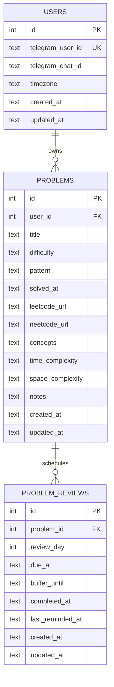

# leetcoach v1 Data and Behavior Spec

## Scope (v1)

This spec covers only:
- log problems
- retrieve/search problems
- due review list
- mark review done
- reminder scheduling for day 7 and day 21 with 48h grace

Deferred:
- attempts/history table
- trivia/flashcards
- dashboard
- Notion importer implementation (mapping only)

## Entity Relationship Model

## Table Definitions

### `users`

Purpose:
- one row per Telegram user
- isolates all data by user

Fields:
- `id` INTEGER PRIMARY KEY
- `telegram_user_id` TEXT NOT NULL UNIQUE
- `telegram_chat_id` TEXT NOT NULL
- `timezone` TEXT NOT NULL DEFAULT `'UTC'`
- `created_at` TEXT NOT NULL
- `updated_at` TEXT NOT NULL

### `problems`

Purpose:
- canonical problem record
- stores long-form preparation notes as plain text

Fields:
- `id` INTEGER PRIMARY KEY
- `user_id` INTEGER NOT NULL REFERENCES `users(id)` ON DELETE CASCADE
- `title` TEXT NOT NULL
- `difficulty` TEXT NOT NULL CHECK (`difficulty IN ('easy','medium','hard')`)
- `pattern` TEXT NOT NULL
- `solved_at` TEXT NOT NULL
- `leetcode_url` TEXT NULL
- `neetcode_url` TEXT NULL
- `concepts` TEXT NULL
- `time_complexity` TEXT NULL
- `space_complexity` TEXT NULL
- `notes` TEXT NULL
- `created_at` TEXT NOT NULL
- `updated_at` TEXT NOT NULL

Constraints and indexes:
- unique per user on LeetCode URL when present
  - unique index: (`user_id`, `leetcode_url`) where `leetcode_url` IS NOT NULL
- unique per user on NeetCode URL when present
  - unique index: (`user_id`, `neetcode_url`) where `neetcode_url` IS NOT NULL
- index: (`user_id`, `pattern`)
- index: (`user_id`, `solved_at`)
- optional index: (`user_id`, `title`)

Notes:
- `concepts`, `time_complexity`, `space_complexity`, and `notes` are plain `TEXT` and can store multiline markdown or plain text.

### `problem_reviews`

Purpose:
- checkpoint/tick-off rows used by reminders and due tracking

Fields:
- `id` INTEGER PRIMARY KEY
- `problem_id` INTEGER NOT NULL REFERENCES `problems(id)` ON DELETE CASCADE
- `review_day` INTEGER NOT NULL CHECK (`review_day IN (7, 21)`)
- `due_at` TEXT NOT NULL
- `buffer_until` TEXT NOT NULL
- `completed_at` TEXT NULL
- `last_reminded_at` TEXT NULL
- `created_at` TEXT NOT NULL
- `updated_at` TEXT NOT NULL

Constraints and indexes:
- unique index: (`problem_id`, `review_day`)
- index: (`due_at`)
- index: (`buffer_until`)
- index: (`completed_at`)

## Reminder and Status Rules

When a problem is logged:
- create two `problem_reviews` rows
  - day 7: `due_at = solved_at + 7d`, `buffer_until = due_at + 48h`
  - day 21: `due_at = solved_at + 21d`, `buffer_until = due_at + 48h`

Status is derived (not stored):
- `done`: `completed_at IS NOT NULL`
- `upcoming`: now < `due_at` and not done
- `pending`: `due_at <= now <= buffer_until` and not done
- `overdue`: now > `buffer_until` and not done

Reminder policy:
- send reminders for pending checkpoints once per day until completed or overdue
- use `last_reminded_at` to prevent duplicates in the same day

## Command Contract (MVP)

- `/log`
  - creates/updates a canonical `problems` row for the user
  - ensures day 7/day 21 review rows exist

- `/due`
  - lists user checkpoints in `pending` or `overdue`

- `/done <problem_id> <review_day>`
  - marks matching checkpoint complete (`completed_at = now`)

- `/search <query>`
  - searches by title, pattern, and notes fields for the user

- `/pattern <pattern_name>`
  - lists user problems for that pattern

## Notion Mapping (Design Only)

Expected mapping into `problems`:
- problem name -> `title`
- difficulty -> `difficulty`
- date solved -> `solved_at`
- LeetCode link -> `leetcode_url`
- NeetCode link -> `neetcode_url`
- concept block -> `concepts`
- time complexity block -> `time_complexity`
- space complexity block -> `space_complexity`
- extra notes -> `notes`

Importer behavior (future):
- dedupe by per-user URL match when available
- if no URL match, fallback to title review/manual confirmation
