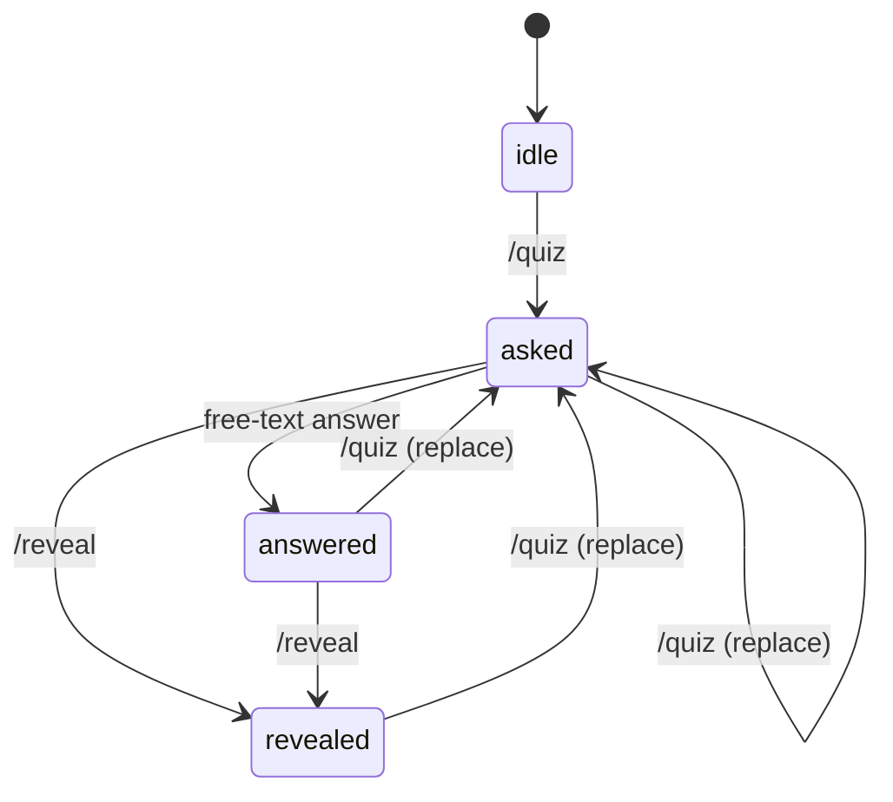

# leetcoach v2 Spec: LLM Quiz Flow (MCQ)

## Scope (v2)

This spec covers:
- LLM-first quiz flow (no static question bank)
- Telegram UX for `/quiz`, free-text answer messages, and `/reveal`
- Gemini model fallback chain
- Minimal persistence required for active quiz state

Out of scope for this version:
- spaced repetition scheduling for quiz questions
- quiz analytics/progress dashboard
- in-context learning or RAG grounding

## Product Goal

Keep interview-relevant DSA theory active throughout the day by serving one MCQ at a time in Telegram, checking free-text answers, and returning formal explanatory feedback.

## Command Contract

### `/quiz`

Usage:
- `/quiz`
- `/quiz <topic>`

Behavior:
- creates a new active quiz for the user
- returns exactly one MCQ with four options (`A`..`D`)
- if another quiz is already active, it is replaced by the new one

Topic handling:
- if the topic is recognized, use it in prompt context
- if topic is not recognized/mapped, bot replies:
  - `Not sure I know this topic. Do you want a general question instead?`
- then waits for a yes/no free-text reply
  - yes -> generate general question
  - no -> stop, no question generated

### Free-text answer messages

Behavior:
- the next non-command message after an active `/quiz` is treated as answer input
- input is free text (examples: `B`, `I think C because...`)
- bot runs answer-check against stored question payload
- bot replies with:
  - correctness verdict
  - why this is correct/incorrect
  - concise formal concept explanation

If no active quiz exists:
- bot replies with guidance to run `/quiz` first

### `/reveal`

Behavior:
- allowed at any time while an active quiz exists (even before answering)
- returns:
  - correct option
  - why that option is correct
  - why other options are wrong
  - concise concept takeaway

If no active quiz exists:
- bot replies with guidance to run `/quiz` first

## LLM Provider Strategy

Provider:
- Gemini API

Fallback chain (priority order):
1. `gemini-2.5-pro`
2. `gemini-2.5-flash`
3. `gemini-2.5-flash-lite`
4. `gemini-2.0-flash`
5. `gemini-2.0-flash-lite`

Selection behavior:
- try highest-priority available model first
- on quota/rate exhaustion for a model, fail over to next model
- continue until one succeeds or all fail
- if all fail, return user-friendly retry message

Model order must be configurable in code through a single list/array.

## Minimal Persistence

No long-term quiz analytics required yet. Persist only active session state needed for reliable command flow across restarts.

### Table: `active_quiz_sessions`

Fields:
- `id` INTEGER PRIMARY KEY
- `user_id` INTEGER NOT NULL REFERENCES `users(id)` ON DELETE CASCADE
- `topic` TEXT NULL
- `question_payload_json` TEXT NOT NULL
- `model_used` TEXT NOT NULL
- `status` TEXT NOT NULL CHECK (`status IN ('asked','answered','revealed')`)
- `user_answer_text` TEXT NULL
- `answer_feedback_json` TEXT NULL
- `asked_at` TEXT NOT NULL
- `answered_at` TEXT NULL
- `revealed_at` TEXT NULL
- `created_at` TEXT NOT NULL
- `updated_at` TEXT NOT NULL

Indexes/constraints:
- unique active row per user:
  - unique index on `(user_id)`
- index on `status`

Notes:
- replacing an active quiz means upsert by `user_id`
- this is operational state, not historical event logging

## Prompt and Output Contracts

Use deterministic JSON contracts for both generation and answer-checking.

### Question generation response schema

```json
{
  "topic": "string",
  "question": "string",
  "options": {
    "A": "string",
    "B": "string",
    "C": "string",
    "D": "string"
  },
  "correct_option": "A|B|C|D",
  "why_correct": "string",
  "why_others_wrong": {
    "A": "string",
    "B": "string",
    "C": "string",
    "D": "string"
  },
  "concept_takeaway": "string"
}
```

### Answer-check response schema

```json
{
  "user_answer_normalized": "string",
  "is_correct": true,
  "verdict_summary": "string",
  "formal_feedback": "string",
  "concept_takeaway": "string"
}
```

## Error Handling

User-facing behavior:
- no active quiz -> instruct `/quiz`
- topic unknown -> ask for general fallback confirmation
- all models unavailable -> instruct retry later

Provider-level behavior:
- classify retryable/transient errors (timeouts, temporary network failures, 5xx)
- retry same model briefly
- then fail over to next model in chain

## State Machine



## Acceptance Criteria (v2)

- `/quiz` returns one MCQ using Gemini model chain
- free-text user answer is evaluated and explained
- `/reveal` works before or after answer
- unknown topic triggers general-question confirmation prompt
- active quiz state survives bot restart
- model fallback works in configured priority order
